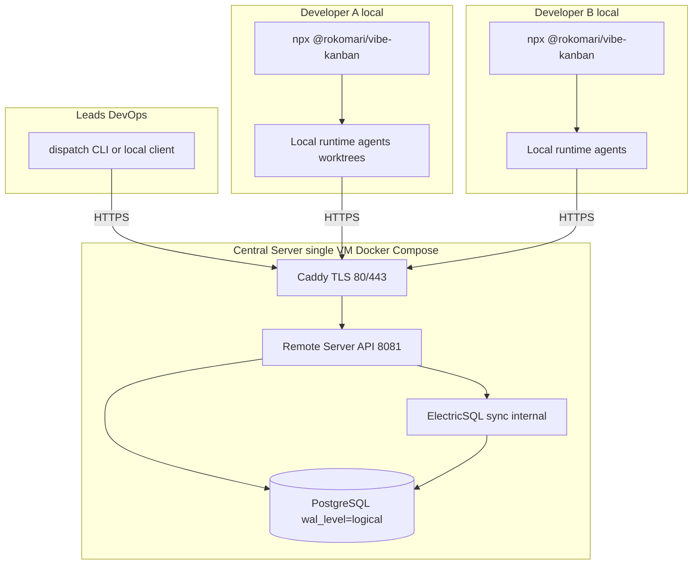

# Centralized Vibe Kanban — Requirements and Plan

> **Companion documents**
> - Architecture and design decisions: [SYSTEM_DESIGN.md](./SYSTEM_DESIGN.md)
> - Phased rollout tasks and acceptance gates: [EXECUTION_PLAN.md](./EXECUTION_PLAN.md)
> - Developer onboarding: [DEVELOPER_ONBOARDING.md](./DEVELOPER_ONBOARDING.md)
> - Ready-to-use central stack: [`DEPLOYMENT_README.md`](./DEPLOYMENT_README.md) · go-live: [`GO_LIVE.md`](./GO_LIVE.md)
> - Client launcher: [`rok-vibe-kanban-launcher/`](./rok-vibe-kanban-launcher/)
> - Distribution fork: [`rok-vibe-kanban-team/`](./rok-vibe-kanban-team/)
>
> **As-built status (current):** Central stack **live** at `https://vk.rokomari.io`
> (Docker Compose: postgres + remote + electric + caddy). Team org "Rokomari SE Team",
> project "Amaly". Client = `@rokomari/vibe-kanban` launcher (Node ≥ 20, port 8154).
> Issue-ingestion API **live** (`POST /ingest/issues`). Auth: bootstrap local admin;
> OAuth + Harbor + npm publish deferred. The original requirements/plan below remain for
> reference; the build deviated to Docker Compose (not k8s) — see SYSTEM_DESIGN §8.

---

## 1) Objective

Build a centralized Vibe Kanban setup where:

- a **central API server** (DevOps-managed) owns team tasks/issues, assignment, and collaboration state
- **every developer** runs a local Vibe Kanban client from `npx @rokomari/vibe-kanban` — mandatory, no browser-only path
- tasks are **distributed via explicit assignment** from the central system to specific developers
- AI agents, git worktrees, and terminals execute **locally** on each developer machine

---

## 2) Scope and Assumptions

| Item | Decision |
|------|----------|
| Starting point | [`rok-vibe-kanban-team`](./rok-vibe-kanban-team/) fork (patch stack + published images + npm wrapper) |
| Central deployment | **Docker Compose, remote-only** on a single Linux VM — no Kubernetes for v1 |
| Client model | **Mandatory local `npx`** for all developers (power-user workflow) |
| Browser mode | **Out of scope** (k8s/sysbox/code-server frontend deferred) |
| Distribution model | Explicit assignment/routing, not shared-board-only |
| Who runs what | **DevOps** owns central infra, secrets, backups, upgrades; **developers** only run local client |
| Licensing | Upstream Apache 2.0 + distribution MIT — no per-seat software cost |

---

## 3) Requirements

### 3.1 Functional Requirements

1. **Central team backend (DevOps-owned)**
   - Self-hosted remote server with PostgreSQL + ElectricSQL real-time sync.
   - Authenticated APIs for organizations, projects, issues, issue assignment, and membership.
   - HTTPS via Caddy + Let's Encrypt; only ports 80/443 public.

2. **Task assignment/distribution**
   - Assign issues to specific developers (`IssueAssignee` model).
   - List issues by assignee (`assignee_user_id` filter) for personal queue.
   - Unassigned issue discovery for leads.

3. **Local developer client (mandatory for all)**
   - One command: `npx @rokomari/vibe-kanban` with central API base pre-configured.
   - No manual `VK_SHARED_API_BASE` setup in the default onboarding path.
   - Personal queue visible after sign-in; workspace/agent execution runs locally.

4. **Real-time synchronization**
   - Issue and assignment changes sync in near real time via ElectricSQL shapes (proxied through remote server).

5. **Team onboarding**
   - OAuth sign-in (GitHub or Google) + optional allowed-email-domain restriction.
   - Invite-based org membership; new members access assigned tasks immediately via local client.

6. **Lead operations**
   - Leads/admins create issues, assign owners, track progress.
   - Repeatable dispatch workflow via UI and thin CLI (assign, bulk-assign, list-unassigned, list-by-dev).

### 3.2 Non-Functional Requirements

1. **Security**
   - TLS on all public endpoints; JWT and DB secrets in git-ignored `.env`.
   - OAuth + domain restriction for closed-team identity.
   - Postgres and Electric internal-only on Docker network.

2. **Reliability**
   - Health checks on remote and Electric; `restart: unless-stopped` + boot survival.
   - Scheduled `pg_dump` backups and tested restore drills.

3. **Operability (DevOps)**
   - Docker Compose deploy/update (`pull` + `up -d` with pinned image tags).
   - Container logs shipped to existing EFK stack for retention.

4. **Developer experience**
   - One pinned launch command; minimal per-developer configuration.
   - Wrapper version policy documented; no ad-hoc local scripts as default.

---

## 4) High-Level Architecture

**Policy:** local `npx` is mandatory for every developer. Browser-only onboarding is not accepted in this rollout.

---

## 5) Implementation Plan (summary)

Detailed task tables live in [EXECUTION_PLAN.md](./EXECUTION_PLAN.md). Phase order:

| Phase | Goal | Deliverable |
|-------|------|-------------|
| **0 — Local validation** | Compose stack up on scratch host; sign-in + issue persistence | Reproducible local baseline ([`DEPLOYMENT_README.md`](./DEPLOYMENT_README.md)) |
| **1 — Production central server** | VM, DNS, TLS, OAuth, pinned images | Stable HTTPS central URL |
| **1.5 — Client gate** | Publish/pin `vibe-kanban-team` wrapper; smoke-test from clean machine | **Mandatory before team rollout** |
| **2 — Org & assignment** | Org, project, invites, assignee lifecycle, unassigned discovery | Documented lead→dev workflow |
| **3 — Developer rollout** | All devs on wrapper-only flow; 3+ machine validation | One command for everyone |
| **4 — Dispatch tooling** | Lead CLI over existing APIs | Repeatable routing |
| **5 — Runbooks** | Dev onboarding, lead playbook, ops (backup/restore/upgrade) | Docs-only onboarding works |
| **6 — Optional** | My Issues UI patch, auto-routing, off-host backups, browser/k8s mode | Only if triggered |

---

## 6) Milestones and Acceptance Criteria

| Milestone | Acceptance |
|-----------|------------|
| **M1 Central backend** | API over HTTPS; OAuth + org/project flows; data persists across restart |
| **M2 Client gate** | `npx @rokomari/vibe-kanban` works from clean machine with no manual config |
| **M3 Assignment** | Lead assigns issue; dev sees it in personal queue via local client |
| **M4 Local execution** | Dev starts workspace from assigned issue; status syncs centrally |
| **M5 Dispatch** | Lead bulk-assigns and lists unassigned from CLI |
| **M6 Onboarding** | New dev completes first assigned task using documentation only |

---

## 7) Risks and Mitigations

| Risk | Mitigation |
|------|------------|
| Upstream slows (community-maintained) | Own patch stack; pin known-good image tags |
| Single VM SPOF | Off-host backups; restore runbook; VM snapshots |
| `latest` image breaks production | Pin tags in `.env`; upgrade deliberately |
| Misconfigured client URL | Wrapper pre-sets API base; wrapper-only onboarding |
| Localhost auth blocks Phase 0 | Explicit dev auth path (OAuth localhost or bootstrap admin) — see P0-T1a |
| "My Issues" UX gap | Decision gate in Phase 2; small frontend patch if needed |
| Secret leakage | Git-ignored `.env`; rotate JWT on compromise |
| Data loss | Scheduled `pg_dump` + tested restore drill |

---

## 8) Roles

| Role | Responsibility |
|------|----------------|
| **DevOps / platform** | VM, Compose stack, DNS/TLS, secrets, backups, image upgrades, EFK logs, dispatch CLI hosting |
| **Lead / admin** | Create projects, assign issues, monitor progress, use dispatch tooling |
| **Developer** | Run `npx @rokomari/vibe-kanban`, sign in, work assigned issues locally |

---

## 9) Immediate Next Steps (after approval)

1. Execute **Phase 0** locally: `cp .env.example .env`, bring up Compose, validate health + sign-in + issue persistence.
2. Execute **Phase 1** on production VM: DNS, OAuth, pinned tags, HTTPS.
3. Complete **Phase 1.5** before inviting the wider team: publish/pin wrapper and smoke-test end-to-end.
4. Proceed to org setup, assignment validation, and developer rollout per [EXECUTION_PLAN.md](./EXECUTION_PLAN.md).
