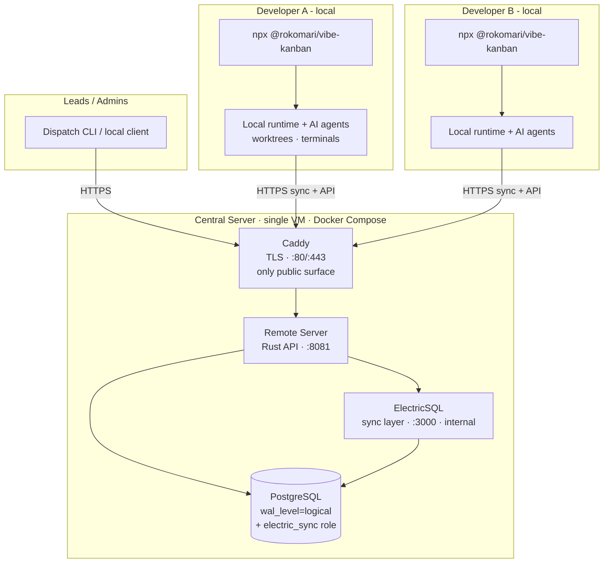
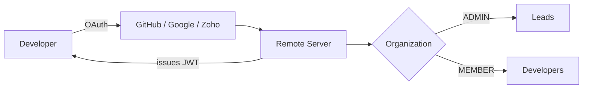
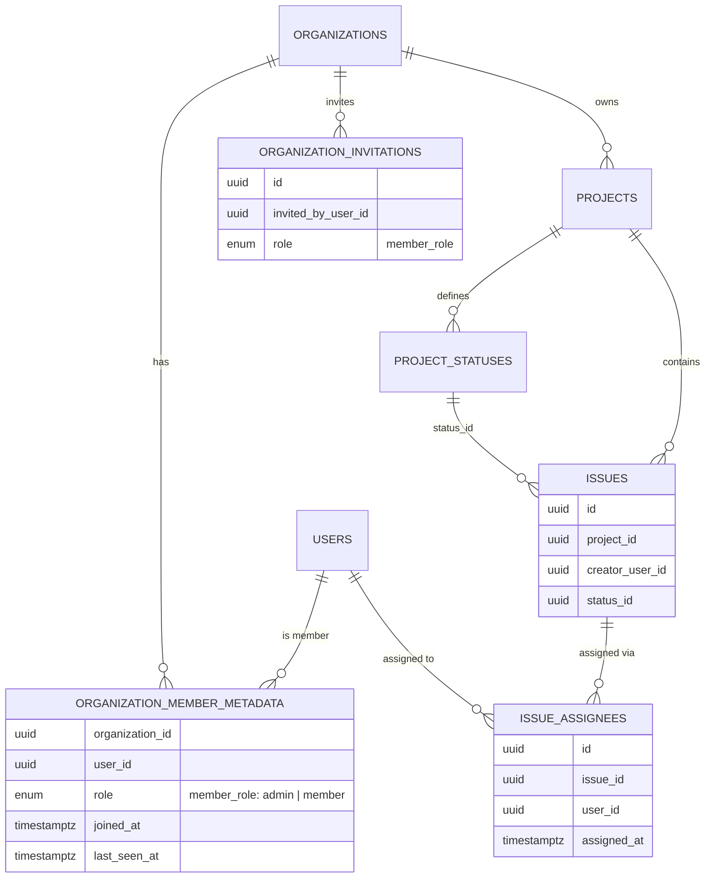
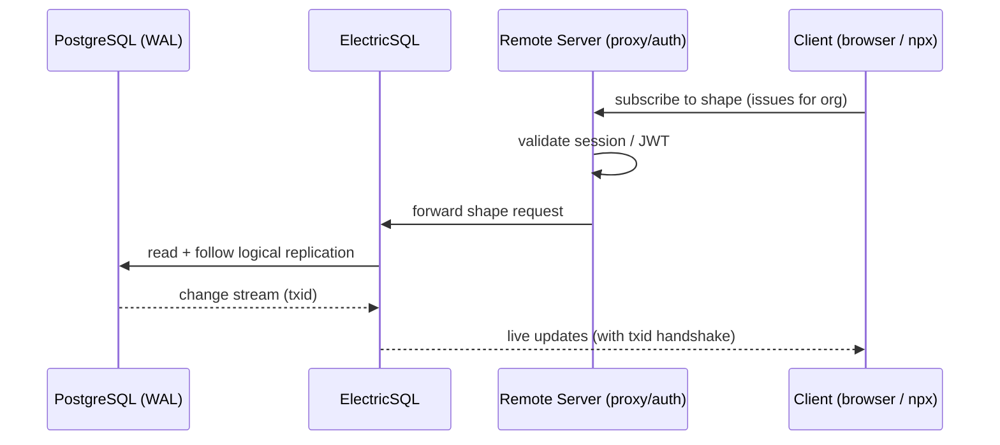

# Centralized Vibe Kanban — Proposed System Design

> Companion to [EXECUTION_PLAN.md](./EXECUTION_PLAN.md). This document describes the
> target architecture, components, data model, and key design decisions for a
> self-hosted, team-wide Vibe Kanban deployment built entirely on free / open-source
> software.

---

## 1) Design Goals

| Goal | Design response |
|------|-----------------|
| Central, shared task/issue state for the whole team | One **Remote Server** + **PostgreSQL** as the single source of truth |
| Explicit task assignment to specific developers | Native `IssueAssignee` model + `assignee_user_id` search filter |
| Near-real-time sync to all connected clients | **ElectricSQL** logical-replication sync layer |
| Mandatory power-user workflow for all developers | Every developer runs local `npx @rokomari/vibe-kanban` (no browser-only mode) |
| Zero software licensing cost | Apache 2.0 upstream + MIT distribution layer; no seats, no keys |
| Operable by a small platform team | Docker Compose stack + pinned images + runbooks (single VM) |

---

## 2) Licensing & Cost Basis (why this is "free")

- **Upstream Vibe Kanban**: Apache License 2.0 — permissive, no production-use or
  competing-offering restriction, no license key, self-host internally for free.
  (Note: the team README still references the older BSL link; this is stale and is
  corrected as a task in the execution plan.)
- **`rok-vibe-kanban-team` distribution layer**: MIT.
- **All runtime dependencies are free/open-source**: PostgreSQL, ElectricSQL,
  Caddy, Let's Encrypt, and the AI CLI executors.
- **Only real costs are infrastructure**: compute (a server/cluster), a domain, and
  storage. No per-seat or per-user software cost.

> **Project-risk note (not a feasibility blocker):** Bloop AI (original author) wound
> down its hosted cloud in April 2026 and the project is now community-maintained.
> The downstream patch stack + nightly upstream tracking in `rok-vibe-kanban-team` is
> our mitigation: we own a controlled, buildable fork.

---

## 3) High-Level Architecture



**One client model, one backend:** every developer runs
`npx @rokomari/vibe-kanban` locally; AI agents, worktrees and terminals execute on
their own machine; all shared state (orgs, issues, assignment) lives centrally and syncs
in real time via ElectricSQL. The central VM exposes **only** the Caddy entrypoint;
Postgres and Electric stay on the internal Docker network.

**Policy:** local `npx` is mandatory for all developers. There is no browser-only
onboarding path in this deployment model.

> Browser mode (a centrally hosted code-server workspace) is intentionally out of scope
> for this deployment — it requires the k8s-only sysbox runtime. See §8.

---

## 4) Component Inventory (Compose services)

| Service | Role | Port | Public? |
|---------|------|------|---------|
| **caddy** | TLS termination + reverse proxy (auto Let's Encrypt) | 80/443 | ✅ only public surface |
| **remote** | Auth, orgs, projects, issues, assignment, API; runs DB migrations | 8081 | via Caddy |
| **electric** | Streams DB changes to clients (real-time sync) | 3000 | ❌ internal |
| **postgres** | Source of truth; logical replication for sync | 5432 | ❌ internal |
| **electric-init** | One-shot: waits for remote `/health` before electric starts | — | ❌ internal |
| **ingest** | Optional issue-ingestion API: `POST /ingest/issues` → auto-create (`--profile ingest`) | 8090 | via Caddy at `/ingest/*` (opt-in) |

### Host / DNS layout (remote-only)

```
vk.example.com   ->  A record -> central VM public IP   (Caddy → remote API)
```

A single A record is enough — no wildcard, no derived subdomains (those were only for
the browser/code-server frontend, which we are not deploying).

### Issue Ingestion API (optional add-on, `--profile ingest`)

A sidecar that turns an inbound POST into a Vibe Kanban issue — for internal tools/automation.

```
caller → Caddy (/ingest/*) → ingest:8090 → remote:8081 (/v1/issues, as service account)
```

- **Auth:** static `X-API-Key` (or `Authorization: Bearer`).
- **Payload (we define it):** `{title, description?, priority?, dedup_key?}`.
- **Behavior:** logs in as a service account via the remote's local auth, resolves the
  project's default status, creates the issue (unassigned), and de-dupes by `dedup_key`
  (persisted on a volume). Tokens auto-refresh.
- **Defaults:** one fixed project, default status by name (`todo`), unassigned.
- Detail + one-time setup: [`ingest/README.md`](./ingest/README.md). Live on
  prod, targeting the "Amaly" project.

---

## 5) Identity, Auth & Membership



- **OAuth providers**: GitHub + Google (native), Zoho (downstream patch). Pick one as
  primary for the team.
- **Allowed-email-domain restriction** (downstream patch) limits sign-up to company
  domains — recommended for a closed team.
- **JWT** secret from the git-ignored `.env` (`openssl rand -base64 32`).
- **Org roles**: `ADMIN` (create/assign/manage) and `MEMBER` (work assigned issues).
- **OAuth callback** must be registered as `https://<PUBLIC_DOMAIN>/v1/oauth/callback/<provider>`.

---

## 6) Data Model (assignment-relevant)

> Verified against the live Phase 0 database — table/column names below are the actual
> migrated schema, not assumptions.



- Membership lives in **`organization_member_metadata`** (composite `organization_id` +
  `user_id`), with a `member_role` enum (`admin` / `member`).
- Issue state is a FK **`issues.status_id` → `project_statuses`** (per-project statuses),
  not a fixed string.
- Assignment is a **junction table** (`issue_assignees`) — supports one *or multiple*
  assignees per issue.
- **Personal queue** = `search_issues(assignee_user_id = <me>)`.
- **Unassigned discovery** (for leads) = issues with no `issue_assignees` rows.

> Verified in Phase 0: assigning an issue produced an `issue_assignees` row, and the
> table is part of the ElectricSQL publication (syncs in real time). A dedicated polished
> "My Issues" navigation view in the frontend is still **not** confirmed; if required,
> budget a small frontend patch (tracked in the execution plan).

---

## 7) Real-Time Sync (ElectricSQL)



**Hard prerequisites on PostgreSQL:**
- `wal_level = logical`
- a dedicated `electric_sync` role with `REPLICATION` privilege
- CloudNativePG sets `wal_level=logical` by default; managed providers (RDS, etc.)
  must be configured explicitly.

---

## 8) Deployment Topology — Decision: Docker Compose (remote-only)

We run **local `npx` clients against a central backend**, so the chosen deployment is
**Docker Compose, remote-only** — no Kubernetes. The browser "frontend pod" is the only
capability that genuinely requires k8s (it needs the sysbox container runtime), and we
are not using browser mode, so we drop it with zero loss to our requirements.

| Option | Best for | Status |
|--------|----------|--------|
| **A. Docker Compose, remote-only** (Postgres + Electric + Remote + Caddy) | Local `npx` clients, single VM, minimal ops | ✅ **CHOSEN** — see [`DEPLOYMENT_README.md`](./DEPLOYMENT_README.md) |
| B. Helm on Kubernetes | Browser-first shared workspaces (sysbox/code-server), port-proxy | Deferred — only if browser mode is needed later |

**What Compose runs** (faithfully translated from the Helm templates):

```
caddy    :80/:443  → TLS termination (Let's Encrypt) — only public entrypoint
  └── remote :8081 → API, auth, orgs, issues, assignment (runs DB migrations)
electric :3000     → real-time sync (internal only; clients reach it via remote)
postgres :5432     → source of truth (wal_level=logical, electric_sync role)
```

**Startup ordering** (encoded in compose `depends_on`): `postgres` healthy →
`remote` migrates → `electric-init` waits on `/health` → `electric` starts. This
mirrors the Helm `initContainer` that gated Electric on completed migrations.

**What we give up vs. Helm:** the browser frontend pod, code-server port-proxy, and the
chart's release automation (`deploy.sh`). Image updates become `docker compose pull && up -d`.

> Concrete artifacts: [`docker-compose.yml`](./docker-compose.yml),
> [`Caddyfile`](./Caddyfile), [`.env.example`](./.env.example),
> [`init-db/`](./init-db/), [`DEPLOYMENT_README.md`](./DEPLOYMENT_README.md).

---

## 9) Security Design (Compose model)

- **TLS everywhere** via Caddy + automatic Let's Encrypt (HTTP-01); only ports 80/443
  are exposed. ElectricSQL and Postgres stay on the internal Docker network.
- **Secrets** in a git-ignored `.env` file: DB passwords, JWT secret, Electric role
  password, OAuth client secrets. `JWT_SECRET` must be valid base64 ≥32 bytes
  (`openssl rand -base64 32`).
- **Closed membership** via OAuth + `ALLOWED_EMAIL_DOMAINS` restriction.
- **Single public surface**: only the remote API is reachable from the internet; the
  sync layer is proxied through it, never exposed directly.
- **Host hardening**: keep 5432/3000 unpublished (they are, by default); restrict SSH.

---

## 10) Reliability & Operations (Compose model)

- **Health checks**: Remote `/health` (via Caddy); ElectricSQL `/v1/health` (internal).
- **Backups**: scheduled `pg_dump` of the `pgdata` volume + periodic restore drills.
- **Upgrades**: pin image tags in `.env` → `docker compose pull && docker compose up -d`.
  Track upstream `remote-v*` releases from the `rok-vibe-kanban-team` distribution.
- **Observability**: `docker compose logs -f <service>`; ship container logs to the
  existing EFK stack for retention.
- **Restart policy**: `unless-stopped` on all long-running services; `docker compose` is
  managed by a systemd unit (or `restart: unless-stopped` + Docker boot enable) so the
  stack survives host reboots.

---

## 11) Key Design Decisions (summary)

1. **Reuse, don't rebuild** — every plan requirement maps to existing capabilities; the
   work is deployment + ops + docs, not feature development.
2. **Docker Compose, remote-only, as the substrate** — matches our local-`npx`-client
   model; drops the k8s-only browser pod we don't need; one VM, minimal ops.
3. **Postgres + ElectricSQL for sync** — accept the `wal_level=logical` + `electric_sync`
   role constraints as first-class prerequisites.
4. **Caddy for TLS** — automatic Let's Encrypt replaces cert-manager + ingress.
5. **OAuth + domain restriction for closed-team identity** — no custom auth.
6. **Own a controlled fork** — the patch stack + nightly upstream tracking is the
   long-term maintenance strategy given upstream is now community-maintained. If browser
   mode is ever needed, the Helm path (Option B) remains available without rework.
7. **Local power-user mode is required for everyone** — all developers run the same
   local `npx` client/runtime and connect to one central backend.
